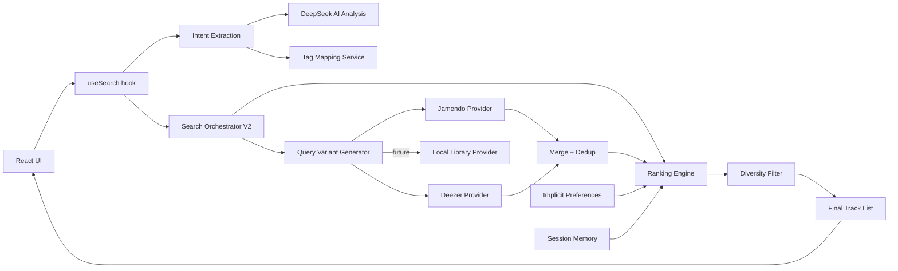
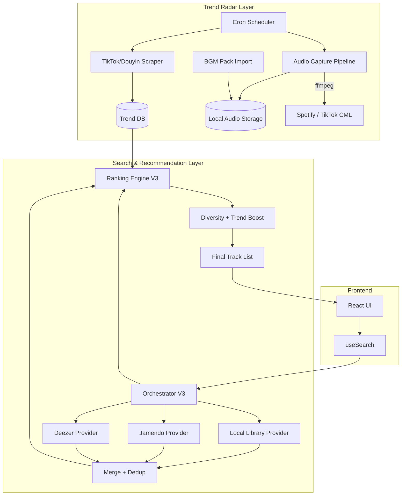
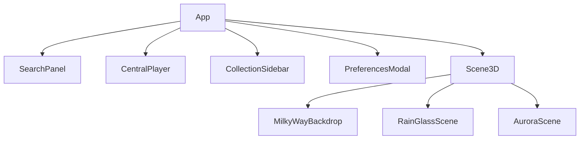

# Architecture and Delivery Plan (updated 2026-02-20)

## TL;DR
- V2 推荐引擎已落地。当前架构支持多 Provider 并行 + 多查询变体 + 多因子评分 + 多样性约束。
- **下一阶段核心**：Trend Radar 爬虫 + Audio Capture + 本地曲库 → 趋势驱动推荐 V3。
- 本文档定义当前架构、目标架构和分阶段交付计划。

---

## 1) Current Architecture (V2, as of 2026-02-20)

### 1.1 Frontend
- React + Vite + TypeScript (strict) + Tailwind CSS
- Main orchestration in `App.tsx`
- Domain hooks: `useSearch`, `usePlayer`, `useCollections`, `usePersistedState`
- Scene modules under `components/visualizer`

### 1.2 Service Layer (V2)



### 1.3 New V2 Modules

| Module | File | Purpose |
|--------|------|---------|
| Query Variant Generator | `services/queryGenerator.ts` | 3 variants (precision/recall/exploration) from single AI call |
| Ranking Engine | `services/rankingEngine.ts` | Multi-factor scoring + diversity-constrained selection |
| Session Memory | `services/sessionMemory.ts` | 200-entry ring buffer for novelty scoring |
| Implicit Preferences | `services/implicitPreferences.ts` | Extract top tags from favorites with recency weighting |
| Provider Registry | `services/providers/index.ts` | Central registry for all MusicProvider adapters |
| Jamendo Provider | `services/providers/jamendoProvider.ts` | Jamendo API adapter (full tracks) |
| Deezer Provider | `services/providers/deezerProvider.ts` | Deezer API adapter (30s previews, via Vite proxy) |

### 1.4 Data
- localStorage for preferences/collections
- No multi-user auth/session yet
- No local music library yet

---

## 2) Target Architecture V3 (Trend-Driven)



### 2.1 Trend Radar
- **定时爬取**：TikTok Trending Music (Apify / TikAPI)、抖音热歌榜（Python 爬虫 / Apify Douyin Scraper）。
- **输出格式**：`{ songTitle, artist, tags[], platform, videoCount, trendPeriod, contentCategories[], scrapedAt }`
- **更新频率**：每日 or 每周（视 API 限制和成本）。
- **存储**：本地 SQLite / JSON 文件 → 未来迁移至 Supabase/Postgres。

### 2.2 Audio Capture Pipeline
- **目标**：对 Trend Radar 发现的热门歌曲获取至少 30s 试听片段。
- **来源优先级**：
  1. Deezer preview (直接 URL，30s MP3，无需录制)
  2. Spotify Web Player (ffmpeg 录制 30s 片段)
  3. TikTok Commercial Music Library (免费商用音频)
  4. YouTube Music (ffmpeg + yt-dlp 提取音频)
- **合规要求**：仅用于个人推荐/试听，不公开分发完整曲目。
- **工具链**：Python + ffmpeg + yt-dlp + Playwright (headless browser)。

### 2.3 Local Music Library
- **数据模型**：
```typescript
interface LocalTrack {
  id: string;              // local-{uuid}
  title: string;
  artist: string;
  tags: string[];
  source: 'trend-capture' | 'purchased-pack' | 'user-upload';
  audioPath: string;       // relative path to audio file
  duration: number;        // seconds
  coverPath?: string;
  trendScore: number;      // 0-100, from Trend Radar
  addedAt: number;         // timestamp
  lastTrendUpdate: number; // when trendScore was last refreshed
}
```
- **收录策略**：
  1. **Trend 驱动**：Trend Radar 热门 → Audio Capture → 自动入库。
  2. **购买 BGM 包**：从小红书 / 淘宝购买常用 BGM 库 → 批量导入脚本。
  3. **手动收录**：管理员手动添加特定歌曲。
- **搜索集成**：实现 `LocalLibraryProvider` (implements `MusicProvider`)，作为最高优先级搜索源。

### 2.4 Ranking V3 评分公式
```
score = W_relevance  * tagOverlapScore
      + W_popularity * normalizedPopularity
      + W_trend      * trendScore            ← NEW
      + W_preference * preferenceMatchScore
      + W_novelty    * noveltyScore
      + W_quality    * qualityScore
```
- `trendScore`：来自 Trend DB，反映该歌曲近期在 TikTok/抖音的热度。
- 本地库歌曲天然有 trendScore；API 结果可通过 title+artist 匹配 Trend DB 获得。

---

## 3) UI Architecture



---

## 4) Mobile Adaptation Plan

> **All changes MUST be mobile-first**: validate on portrait viewports (360–412px width) before merging.

### 4.1 Viewport matrix
| Width | Height | Example device |
|-------|--------|----------------|
| 360   | 800    | Galaxy S21     |
| 390   | 844    | iPhone 14      |
| 412   | 915    | Pixel 7        |
| 768   | 1024   | iPad Mini      |

### 4.2 Shader rendering rules
- All full-screen shaders use clip-space 2×2 quad: `gl_Position = vec4(position.xy, 0, 1)`.
- UV normalised by `min(uResolution.x, uResolution.y)`.
- `uResolution` sourced from `state.gl.domElement.width/height`.

---

## 5) User Authentication Plan (Phase E)

### MVP scope
1. Invite-code onboarding (initial 5 seats).
2. User login/logout.
3. Per-user preferences/favorites persistence.
4. Admin view for user list / basic status.

### Suggested path
1. Choose auth provider (e.g., Supabase Auth, Firebase Auth).
2. Add backend user profile endpoints.
3. Migrate localStorage → user-scoped storage.
4. Preserve local fallback for guest mode.

---

## 6) Delivery Phases

| Phase | Content | Status |
|-------|---------|--------|
| A | Recommendation Engine V2 | ✅ Complete |
| B | Mobile rendering robustness + real device QA | 🟡 Partial |
| C | Auth + user data persistence | ⬜ Not started |
| **D** | **Trend Radar + Audio Capture + Local Library** | **⬜ Next priority** |
| E | User system + cloud persistence | ⬜ Planned |

### Phase D Breakdown (proposed sprints)

| Sprint | Task | Description |
|--------|------|-------------|
| D.1 | Trend Radar MVP | Python 脚本 + Apify，爬取 TikTok/抖音 Top 100，输出 JSON |
| D.2 | Local Library schema + import tool | SQLite/JSON DB + batch import from purchased BGM packs |
| D.3 | Audio Capture pipeline | ffmpeg 脚本，从 Deezer/Spotify 录制 30s 片段 |
| D.4 | LocalLibraryProvider | 实现 MusicProvider 接口，集成到 Orchestrator |
| D.5 | Trend-boosted ranking | 在 RankingEngine 中加入 trendScore 权重 |
| D.6 | Continuous ingestion cron | 自动定期爬取 + 录制 + 入库 |

---

## 7) Decision Log

| Date | Decision | Reason |
|------|----------|--------|
| 2026-02-19 | Adopt adapter pattern for multi-provider | Decoupling, extensibility |
| 2026-02-19 | Integrate Deezer as second provider | Free API, 30s previews, no auth needed |
| 2026-02-20 | Complete Recommendation Engine V2 | Multi-query, scoring, diversity, session memory |
| 2026-02-20 | Next priority: Trend Radar + Local Library | Core value = trend-driven recommendations |
